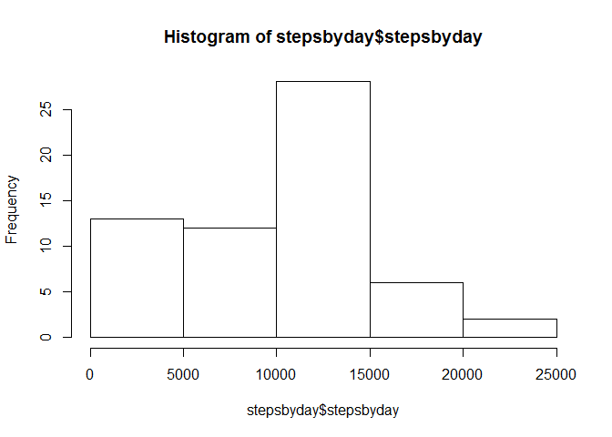
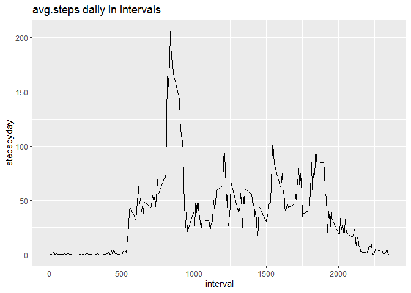
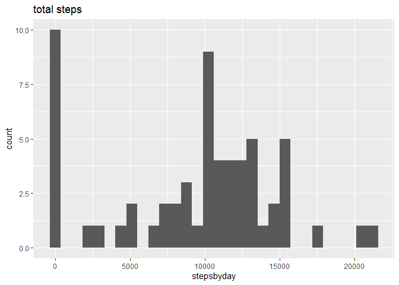

## Loading and preprocessing the data
First, I will unzip the files using the unzip function. Then, I will read in the resulting csv into the dataframe titled activity, using the read.csv function.
I also ran a str function to see, exactly, which variables are present within the dataset.

```r
unzip("activity.zip")
activity<-read.csv("activity.csv")
str(activity)
```

```
## 'data.frame':	17568 obs. of  3 variables:
##  $ steps   : int  NA NA NA NA NA NA NA NA NA NA ...
##  $ date    : Factor w/ 61 levels "2012-10-01","2012-10-02",..: 1 1 1 1 1 1 1 1 1 1 ...
##  $ interval: int  0 5 10 15 20 25 30 35 40 45 ...
```


## What is mean total number of steps taken per day?

```r
library("dplyr")
```

```
## 
## Attaching package: 'dplyr'
```

```
## The following objects are masked from 'package:stats':
## 
##     filter, lag
```

```
## The following objects are masked from 'package:base':
## 
##     intersect, setdiff, setequal, union
```

```r
#calculate total steps per day 
stepsbyday<-activity %>% select(steps, date) %>% group_by(date) %>% summarize(stepsbyday=sum(steps, na.rm=TRUE))
#create histogram of total steps per day 
hist(stepsbyday$stepsbyday)
```

<!-- -->

```r
#calculate mean and median steps per day 
mean(stepsbyday$stepsbyday, na.rm=TRUE)
```

```
## [1] 9354.23
```

```r
median(stepsbyday$stepsbyday, na.rm=TRUE)
```

```
## [1] 10395
```


## What is the average daily activity pattern?

```r
library("dplyr")
library("ggplot2")
```

```
## Warning: package 'ggplot2' was built under R version 3.6.3
```

```r
#calculate average number of steps taken over the 5-minute intervals 
stepsbyday<-activity %>% select (steps, date, interval) %>% group_by(interval) %>% summarize(stepsbyday=mean(steps, na.rm=TRUE))
#graph the plot
ggplot(stepsbyday, aes(x=interval, y=stepsbyday))+ geom_line()+labs(title="avg.steps daily in intervals")
```

<!-- -->

```r
#calculate interval that has max number of steps 
stepsbyday[stepsbyday$stepsbyday==max(stepsbyday$stepsbyday),]
```

```
## # A tibble: 1 x 2
##   interval stepsbyday
##      <int>      <dbl>
## 1      835       206.
```


## Imputing missing values
According to the xray package,there is approximately 13.11% missing. I subsetted the missing steps, placed them into a dataframe named ismissing, and then used dplyr to spell out the specific dates with missing steps. 

```r
library("xray")
```

```
## Warning: package 'xray' was built under R version 3.6.2
```

```r
anomalies(activity)
```

```
## $variables
##   Variable     q  qNA    pNA qZero  pZero qBlank pBlank qInf pInf qDistinct
## 1    steps 17568 2304 13.11% 11014 62.69%      0      -    0    -       618
## 2 interval 17568    0      -    61  0.35%      0      -    0    -       288
## 3     date 17568    0      -     0      -      0      -    0    -        61
##      type anomalous_percent
## 1 Integer            75.81%
## 2 Integer             0.35%
## 3  Factor                 -
## 
## $problem_variables
##  [1] Variable          q                 qNA               pNA              
##  [5] qZero             pZero             qBlank            pBlank           
##  [9] qInf              pInf              qDistinct         type             
## [13] anomalous_percent problems         
## <0 rows> (or 0-length row.names)
```

```r
ismissing<-(activity[is.na(activity$steps),])
ismissing %>% distinct(date)
```

```
##         date
## 1 2012-10-01
## 2 2012-10-08
## 3 2012-11-01
## 4 2012-11-04
## 5 2012-11-09
## 6 2012-11-10
## 7 2012-11-14
## 8 2012-11-30
```
To impute missing values, I am going to use the "roughfix" portion of the randomForest package. Since steps is numeric, it imputes the median for the variable. As we can see, the median of both of the dataframes are equal. While the means have a 5 step gap, the variance are quite close. 

Compared to the estimate, the mean is approximately 2-3K steps higher. Evidently, imputing the missing value has an impact. 


```r
library("randomForest")
```

```
## Warning: package 'randomForest' was built under R version 3.6.2
```

```
## randomForest 4.6-14
```

```
## Type rfNews() to see new features/changes/bug fixes.
```

```
## 
## Attaching package: 'randomForest'
```

```
## The following object is masked from 'package:ggplot2':
## 
##     margin
```

```
## The following object is masked from 'package:dplyr':
## 
##     combine
```

```r
set.seed(20)
ismissing.roughfix<-na.roughfix(activity)
median(activity$steps, na.rm=TRUE)
```

```
## [1] 0
```

```r
median(ismissing.roughfix$steps)
```

```
## [1] 0
```

```r
mean(activity$steps,na.rm=TRUE)
```

```
## [1] 37.3826
```

```r
mean(ismissing.roughfix$steps)
```

```
## [1] 32.47996
```

```r
var(activity$steps, na.rm=TRUE)
```

```
## [1] 12543
```

```r
var(ismissing.roughfix$steps)
```

```
## [1] 11057.17
```


```r
#recalculate total steps per day 
stepsbyday<-ismissing.roughfix %>% select(steps, date) %>% group_by(date) %>% summarize(stepsbyday=sum(steps, na.rm=TRUE))
ggplot(stepsbyday, aes(x=stepsbyday))+geom_histogram()+labs(title="total steps")
```

```
## `stat_bin()` using `bins = 30`. Pick better value with `binwidth`.
```

<!-- -->


## Are there differences in activity patterns between weekdays and weekends?


```r
ismissing.roughfix$date<-as.Date(ismissing.roughfix$date)
ismissing.roughfix$date<-weekdays(ismissing.roughfix$date)
```
